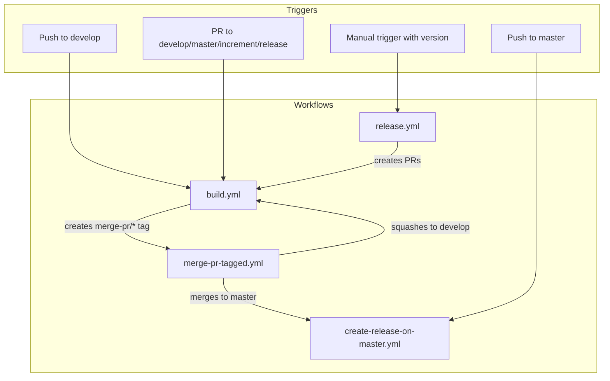
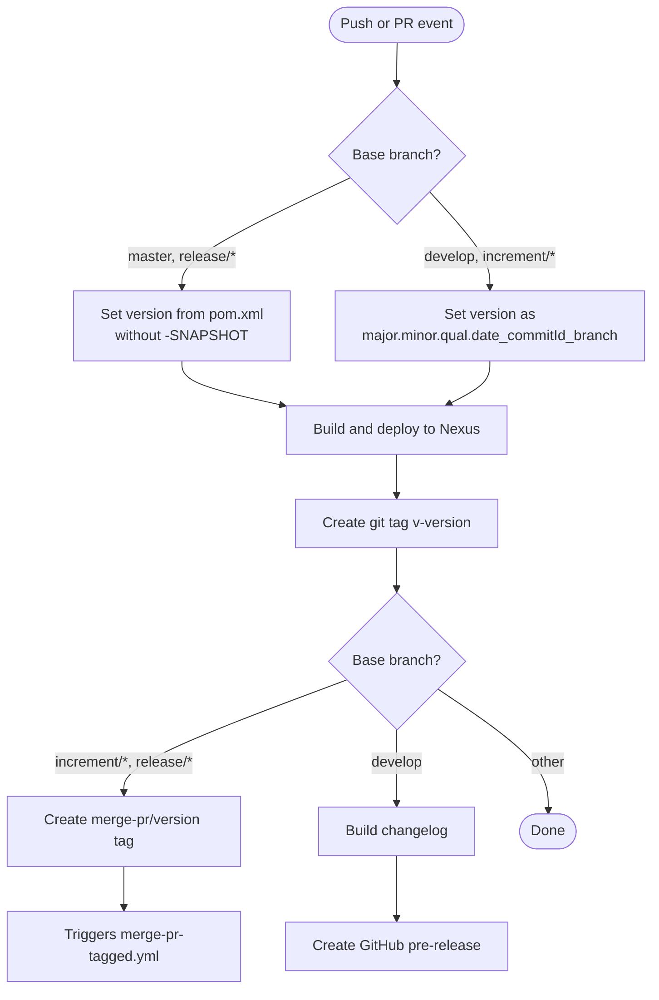
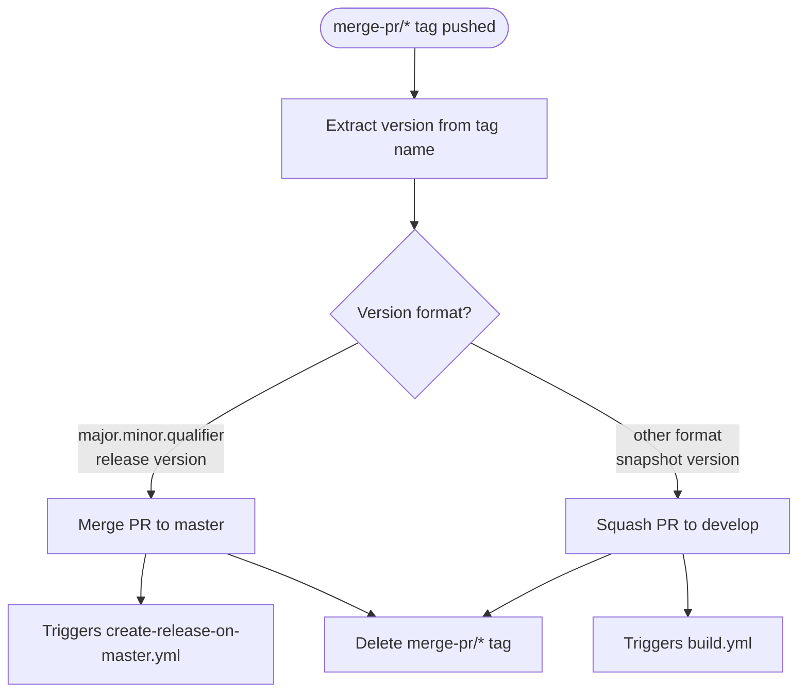
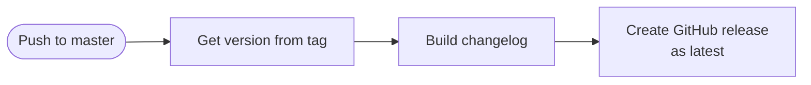
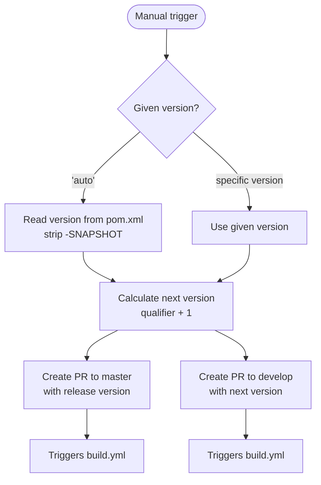

# Development Version and Branch Handling

This document describes the Git branching strategy, version numbering policy, and CI/CD pipeline flows for the judo-meta-liquibase project.

## Branches

The versioning policy is based on [GitFlow](https://www.atlassian.com/git/tutorials/comparing-workflows/gitflow-workflow). All branches serve specific purposes in the release lifecycle:

| Branch Pattern | Base | Purpose |
|---------------|------|---------|
| `develop` | — | Main development branch; contains latest development sources of the active version |
| `feature/JNG-NUMBER_short_summary` | `develop` | New features to be included in the next release |
| `(release/)X.Y.Z` | `develop` | Release preparation branches (`release/` prefix is reserved for CI) |
| `bugfix/JNG-NUMBER_short_summary` | release branch | Bug fixes applied to release branches; must be backported to newer versions |
| `support/JNG-NUMBER_short_summary` | release branch | Minor updates to a previous release |
| `master` | — | Contains the latest released sources |
| `hotfix/JNG-NUMBER_short_summary` | `master` | Critical production fixes applied to both release and master |

### Branch Lifecycle

```mermaid
gitGraph
    commit id: "initial"
    branch develop order: 1
    checkout develop
    commit id: "dev-1"

    branch feature/JNG-1 order: 2
    commit id: "feat-1a"
    commit id: "feat-1b"
    checkout develop
    merge feature/JNG-1 id: "merge-feat-1"

    branch feature/JNG-2 order: 3
    commit id: "feat-2a"
    checkout develop
    merge feature/JNG-2 id: "merge-feat-2"

    branch release/1.0 order: 4
    commit id: "release-prep"

    branch bugfix/JNG-4 order: 5
    commit id: "fix-4"
    checkout release/1.0
    merge bugfix/JNG-4 id: "merge-fix"

    checkout master
    merge release/1.0 id: "v1.0"
    checkout develop
    merge release/1.0 id: "back-merge"
```

## Version Numbers

Version numbers follow semantic versioning with these rules:

| Event | Version Change | Example |
|-------|---------------|---------|
| Start a `feature/` branch | No change | stays at `1.0.2-SNAPSHOT` |
| Start a `release/` branch from develop | Bump 2nd number on `develop` | develop becomes `1.1.0-SNAPSHOT` |
| Bug fixes on `release/` branch | No change | stays at `1.0.2` |
| Start a `support/` branch | Bump 3rd number | becomes `1.0.3` |
| Start a `hotfix/` branch | Bump 4th number | becomes `1.0.2.1` |

### Version Format by Context

| Context | Format | Example |
|---------|--------|---------|
| Release (`master`, `release/*`) | `major.minor.qualifier` | `1.0.2` |
| Development (`develop`, `increment/*`) | `major.minor.qualifier.date_commitId_branchName` | `1.0.2.20260225_143000_abc123_develop` |

## GitHub Actions CI/CD Flows

The project uses several GitHub Actions workflows that trigger each other in a chain:

### Overall Pipeline



### build.yml — Main Build Pipeline

This is the primary workflow, triggered on pushes to `develop` and pull requests to `develop`, `master`, `increment/*`, and `release/*` branches.



### merge-pr-tagged.yml — PR Merge Handler

Triggered when a `merge-pr/*` tag is pushed. Determines whether to merge to master (release) or squash to develop (snapshot).



### create-release-on-master.yml — Release Publisher

Triggered on pushes to `master`. Creates a GitHub release with a generated changelog.



### release.yml — Manual Release Trigger

Manually triggered with a version parameter. Creates the necessary PRs to initiate a release.



## Development Process

For issue tracking, the project uses [JIRA](https://blackbelt.atlassian.net/jira/dashboards).

> **Important:** There is no commit without a ticket number. Every pull request and commit must include a `JNG-xxx` reference.
