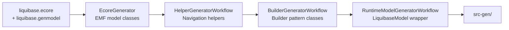
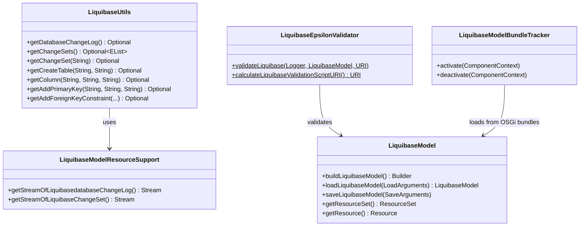
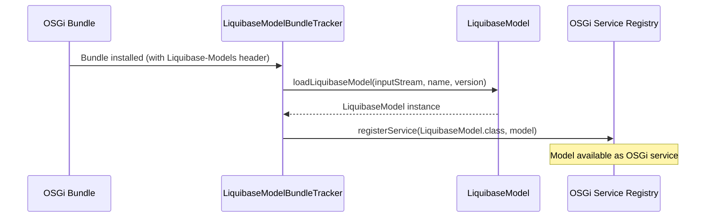

# Contributing to judo-meta-liquibase

## Development Environment

### Prerequisites

| Tool | Version | Notes |
|------|---------|-------|
| **JDK** | 21 | Required by both Maven and Tycho |
| **Maven** | 3.9.4+ | A Maven wrapper (`./mvnw`) is included in the repository |

For full details on environment setup, see the parent project's [judo-community CONTRIBUTING guide](https://github.com/BlackBeltTechnology/judo-community/blob/develop/CONTRIBUTING.adoc).

## Code Structure

This project follows a standard Maven multi-module layout with special handling for Eclipse/Tycho packaging.

### Eclipse-Related Modules

These modules handle Eclipse IDE integration and distribution:

| Module | Purpose |
|--------|---------|
| `feature/` | Eclipse feature definition — allows installing this metamodel as an Eclipse feature |
| `site/` | Eclipse Update Site — every built version is compiled as a P2 update site with all required referenced repositories |

> **Note:** JUDO update sites are version-based (version numbers are encoded in the URL). The site's category definition is loaded as a Tycho extension because version numbers must be resolved before Tycho activates.

### Model Modules

| Module | Purpose |
|--------|---------|
| `model/` | Eclipse plugin containing the Ecore metamodel, EMF-generated Java classes, plus hand-written builders and helpers added via MWE2 workflow |
| `model-test/` | Unit tests for the model, builders, and utilities |

### OSGi Wrapper Modules

| Module | Purpose |
|--------|---------|
| `osgi/` | OSGi bundle that repackages the model and adds extra services for consumers in transformation pipelines on non-Eclipse platforms |
| `osgi-itest/` | Integration tests for the OSGi wrapper, run inside an Apache Karaf container |

## Build Commands

```bash
# Full build
./mvnw clean install

# Run all tests
./mvnw clean test

# Skip tests
./mvnw clean install -DskipTests

# Regenerate model code after editing liquibase.ecore/genmodel
./mvnw -f model/pom.xml clean install
```

## Code Generation

The EMF model classes are generated from the Ecore metamodel using an MWE2 workflow. The generation pipeline runs four steps:



Generated code goes to `model/src-gen/` and is regenerated on every build. **Do not edit files in `src-gen/` manually.**

### Running Generation in Eclipse

**Required Eclipse features:**
- XTend, XText, MWE, MWE2

Use the predefined launcher to regenerate:

```
Generate JSL.launch
```

Or run directly as an MWE2 Workflow:

```
hu.blackbelt.judo.meta.liquibase.model project src/workflow/generateModel.mwe2
```

## Working with Eclipse

### Plugin Requirements

- m2e (Maven Integration)
- Epsilon
- Modeling Tools

### Installation

Install the plugin via P2 sites: go to **Install New Software** and add the URL of the update site listed on GitHub (or point to an uncompressed ZIP folder). The plugin contains the metamodel and the default editor UI.

## Architecture

### Class Relationships



### Runtime Flow: Model Loading in OSGi



## Troubleshooting

### JUnit Tests in Eclipse

There is a known issue where Eclipse + Tycho doesn't include JUnit on the classpath. A `Required-Bundle` entry has been added to the OSGi Manifest as a workaround. If tests still fail, ensure the following is in your `.classpath`:

```xml
<classpathentry kind="con" path="org.eclipse.jdt.junit.JUNIT_CONTAINER/5"/>
```

See: [Eclipse Bug 534587](https://bugs.eclipse.org/bugs/show_bug.cgi?id=534587)

### Lombok

Tycho does not support Lombok generation directly ([lombok#285](https://github.com/rzwitserloot/lombok/issues/285)). For this reason, **Lombok is not used in Eclipse plugin code** — all source code in the `model/` Eclipse plugin is either hand-written without Lombok or generated by EMF. Lombok is used in the `osgi/` module which is built with standard Maven.

### Tycho Repository References

Tycho 1.4.0 and below does not handle repository references inside site definitions, so all referenced plugin sites must be added manually. See: [Eclipse Bug 453708](https://bugs.eclipse.org/bugs/show_bug.cgi?id=453708)

## Version Policy

Maven and Eclipse have different version conventions:

| Convention | Example | Used By |
|-----------|---------|---------|
| SNAPSHOT | `1.0.2-SNAPSHOT` | Maven |
| qualifier | `1.0.2.qualifier` | Eclipse/OSGi (MANIFEST.MF) |

These are equivalent — `1.0.2.qualifier` is the Eclipse notation for Maven's `1.0.2-SNAPSHOT`. The Tycho Versions Plugin replaces qualifiers and Maven versions with technical version numbers during each build.

## Submitting Issues

Before submitting, search the [issue tracker](https://github.com/BlackBeltTechnology/judo-meta-liquibase/issues) — your problem may already be resolved.

To help us reproduce and fix bugs quickly, please include:
- Output of `java -version` and `mvn -version`
- Relevant `pom.xml` or `.flattened-pom.xml`
- A minimal reproducible use case

File new issues using the [issue form](https://github.com/BlackBeltTechnology/judo-meta-liquibase/issues/new/choose).

## Submitting Pull Requests

This project follows [GitHub's standard forking model](https://guides.github.com/activities/forking/). Fork the project and submit pull requests from your fork.

> **Important:** Every commit and PR must include a JIRA ticket number (e.g., `JNG-1234`).
