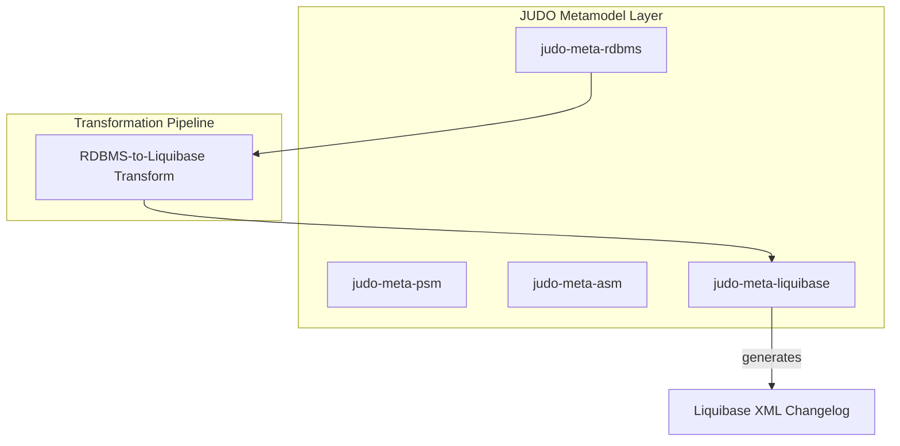
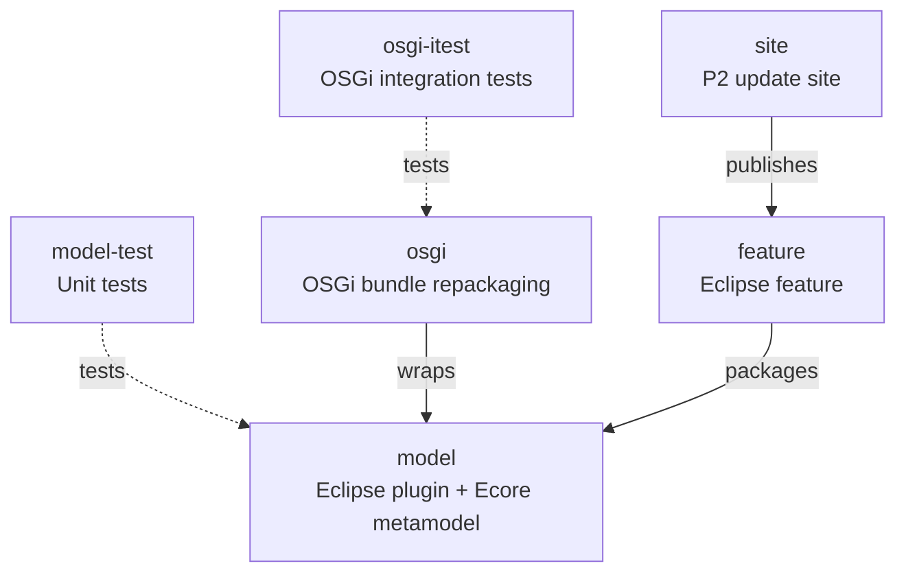

# judo-meta-liquibase

[](https://github.com/BlackBeltTechnology/judo-meta-liquibase/actions/workflows/build.yml)

## Introduction

This project provides an **EMF (Eclipse Modeling Framework) metamodel** for [Liquibase](https://www.liquibase.org/) database change management. It is an extended, model-driven version of the Liquibase first-party XML schema, re-expressed as an Ecore metamodel so it can be used programmatically in transformation pipelines, validated with Epsilon rules, and manipulated through generated Java APIs.

The module works in two deployment modes:

- **Eclipse plugin** — with features and an update site, so it integrates into the Eclipse IDE for visual modeling and editing.
- **Standalone OSGi bundle** — for use outside Eclipse, in standard OSGi containers (e.g., Apache Karaf) and Maven-based transformation pipelines.

## How It Fits Into the JUDO Platform

This project is a building block of the [judo-community](https://github.com/BlackBeltTechnology/judo-community) aggregator project. It sits in the metamodel layer alongside other `judo-meta-*` modules (PSM, ASM, RDBMS, etc.) and provides the Liquibase representation used during model-to-database transformations.



## Module Overview

The project is a multi-module Maven build using Tycho for Eclipse plugin packaging:



| Module | Type | Description |
|--------|------|-------------|
| `model/` | Eclipse plugin | Core Ecore metamodel, generated EMF classes (`src-gen/`), hand-written runtime API, Epsilon validation rules, and MWE2 code generation workflow |
| `model-test/` | JAR | JUnit 5 unit tests for model builders, utilities, and validation |
| `osgi/` | OSGi bundle | Repackages the model plugin as a standalone OSGi bundle via Felix maven-bundle-plugin |
| `osgi-itest/` | Test JAR | Integration tests using Pax Exam with an Apache Karaf container |
| `feature/` | Eclipse feature | Groups the model plugin for Eclipse installation |
| `site/` | P2 repository | Generates an Eclipse update site for distribution |

## Quick Start

**Requirements:** Java 21, Maven 3.9.4+

```bash
# Full build (all modules)
./mvnw clean install

# Run all tests
./mvnw clean test

# Build only the model module (includes code generation)
./mvnw -f model/pom.xml clean install

# Skip tests for faster builds
./mvnw clean install -DskipTests
```

## Key Runtime API

The hand-written runtime code in `model/src/main/java/` provides the primary programmatic interface:

### Building a Model

```java
LiquibaseModel model = LiquibaseModel.buildLiquibaseModel()
    .name("mychangelog")
    .uri(URI.createFileURI("changelog.xml"))
    .build();
```

### Querying with LiquibaseUtils

```java
LiquibaseUtils utils = new LiquibaseUtils(resourceSet);
Optional<ChangeSet> cs = utils.getChangeSet("cs-001");
Optional<CreateTable> table = utils.getCreateTable("cs-001", "USERS");
Optional<Column> col = utils.getColumn("cs-001", "USERS", "name");
```

### Validating with Epsilon

```java
URI scriptRoot = LiquibaseEpsilonValidator.calculateLiquibaseValidationScriptURI();
LiquibaseEpsilonValidator.validateLiquibase(logger, model, scriptRoot);
```

## Contributing

Everyone is welcome to contribute! Please read the [Contributing Guide](CONTRIBUTING.md) for details on setting up your development environment, code structure, and submission guidelines.

## License

This project is licensed under the [Eclipse Public License - v 2.0](https://www.eclipse.org/legal/epl-2.0/).
